<h1 style="font-weight:normal">
  
  &nbsp;Bundla – Laravel in Docker
</h1>

[](https://t.me/tgaru)
[](https://github.com/tgaru/bundla/releases)

[](https://codeclimate.com/github/tgaru/bundla/maintainability)
[](./LICENSE.md)

A quick way to create a Laravel project for development!

[Bundla](https://bundla.github.io) is a console utility for raising the development environment on Laravel + Docker, with the necessary configuration and environment.
<p align='center'>

</p>

## Table of contents
- [How it works?](#how-it-works)
- [Supported OS](#supported-os)
- [Dependencies](#dependencies)
- [Installing Bundla](#installing-bundla)
- [Install Laravel bundle](#install-Laravel-bundle)
- [Commands](#commands)
- [Project Supported Bundles](#project-supported-bundles)
- [Project Supported Modules](#project-supported-modules)
- [Structure of the created projects](#structure-of-the-created-projects)
- [How to create your Laravel bundle?](#how-to-create-your-laravel-bundle)
- [How to create your Docker Compose module?](#how-to-create-your-docker-compose-module)
- [Images Docker](#images-docker)
- [Versioning](#versioning)
- [Contributing](#contributing)
- [License](#license)

## How it works?
[Install the Bundla](https://bundla.github.io) console utility. Find the desired bundle and install it with one command.

Bundla will automatically install the specific version of Laravel, generate the files `docker-compose.yml`,` composer.json`, `package.json`,` .env` for Laravel, `.env` for Docker Compose and launch the containers.

The created projects are based on the «Laravel bundles», which consist of Laravel parameters, instructions and «Docker Compose modules».

**Laravel bundle** – a set of parameters, instructions and Docker Compose modules for creating a complete development environment for Laravel and Docker.

**Docker Compose module** – a set of parameters for forming a Docker container.

In addition, the Bundle allows you to quickly execute the Docker Compose commands and Shell commands inside the «app» container.

## Supported OS
* Ubuntu >= 16.04
* Debian >= 9
* MacOS >= 10.14.6

## Dependencies
* Git
* Docker
* Docker Compose

Bundla installer will automatically install dependencies on Linux.

On MacOS, you need to install the dependencies manually before installing Bundla.

## Installing Bundla

```bash
/bin/bash -c "$(curl -fsSL https://raw.githubusercontent.com/tgaru/bundla/master/install.sh)"
```

## Install Laravel bundle
1. Create a new folder for your project and go to it.

    ```bash
    mkdir project && cd ./project
    ```

2. **Install the desired Laravel bundle**

    ```bash
    bundla i bundla/laravel-7.6-lite
    ```
    
    This example install Laravel bundle [bundla/laravel-7.6-lite](http://github.com/bundla/laravel-7.6-lite).
    
    You can specify the version of the bundle (repository release) through a colon, Example:
   
    ```bash
    bundla i bundla/laravel-7.6-lite:^1.0
    ```

## Commands
| Command | Description |
| - | - |
| `bundla i <bundle-key>` | Install Laravel bundle |
| `bundla create bundle` | Create a new bundle based on a template |
| `bundla create module` | Create a new module based on a template |
| `bundla app "<shell-command>"` | Run the command inside the container «app» |
| `bundla help` | Bundla Command List |
| `bundla app` | Analogue \[docker-compose exec app sh\] |
| `bundla ps` | Analogue \[docker-compose ps\] |
| `bundla up` | Analogue \[docker-compose up -d\] |
| `bundla down` | Analogue [docker-compose down\] |
| `bundla build` | Analogue \[docker-compose build\] |
| `bundla restart` | Analogue \[docker-compose restart\] |
| `bundla stop` | Analogue \[docker-compose stop\] |
| `bundla start` | Analogue \[docker-compose start\] |

## Project Supported Bundles
| Bundle key name | Title |
| - | - |
| [bundla/laravel-7.6-lite](https://github.com/bundla/laravel-7.6-lite) | Laravel 7.6 Lite |
| [bundla/laravel-7.6-postgres](https://github.com/bundla/laravel-7.6-postgres) | Laravel 7.6 + PostgreSQL |
| [bundla/laravel-7.6-mysql](https://github.com/bundla/laravel-7.6-mysql) | Laravel 7.6 + MySQL |
| [bundla/laravel-7.6-horizon](https://github.com/bundla/laravel-7.6-horizon) | Laravel 7.6 + Horizon |
| [bundla/laravel-7.6-vue-postgres](https://github.com/bundla/laravel-7.6-vue-postgres) | Laravel 7.6 + Vue + PostgreSQL |
| [bundla/laravel-7.6-vue-mysql](https://github.com/bundla/laravel-7.6-vue-mysql) | Laravel 7.6 + Vue + MySQL |
| [bundla/laravel-7.6-tgbot-vue-postgres](https://github.com/bundla/laravel-7.6-tgbot-vue-postgres) | Laravel 7.6 + Telegram Bot SDK + Vue + PostgreSQL |
| [bundla/laravel-7.6-tgbot-vue-mysql](https://github.com/bundla/laravel-7.6-tgbot-vue-mysql) | Laravel 7.6 + Telegram Bot SDK + Vue + MySQL |

## Project Supported Modules
| Module key name | Docker Image |
| - | - |
| [bundla/m-app-php-7.2](https://github.com/bundla/m-app-php-7.2) | tgaru/bundla-php:7.2 |
| [bundla/m-nginx-latest](https://github.com/bundla/m-nginx-latest) | tgaru/bundla-nginx:latest |
| [bundla/m-scheduler-php-7.2](https://github.com/bundla/m-scheduler-php-7.2) | tgaru/bundla-php:7.2 |
| [bundla/m-horizon-php-7.2](https://github.com/bundla/m-horizon-php-7.2) | tgaru/bundla-php:7.2 |
| [bundla/m-postgres-12.3](https://github.com/bundla/m-postgres-12.3) | postgres:12.3 |
| [bundla/m-mysql-8.0](https://github.com/bundla/m-mysql-8.0) | mysql:8.0 |
| [bundla/m-redis-6.0](https://github.com/bundla/m-redis-6.0) | redis:6.0 |

## Structure of the created projects

```
project
├── .env
├── .env.example
├── .gitignore
├── docker-compose.yml
└── src/
    ├── .env
    ├── .env.example
    ├── composer.json
    ├── package.json
    └── ...Laravel files and folders...
```

`.env` – environment variables for Docker Compose

`.env.example` – copy of the `.env` file

`.gitignore` – Git ignored data file (optional)

`docker-compose.yml` – Docker Compose main configuration file

`src/` – folder loaded with Laravel

`src/.env` – environment variables for Laravel

`src/.env.example` – copy of the `src/.env` file

`src/composer.json` – config file Composer

`src/package.json` –  config file NPM

The content of these files varies depending on the bundle.

## How to create your Laravel bundle?
1. Run the command `bundla create bundle`.

2. Enter the data according to the instructions in the console. As a result, the directory `~/.bundla/vendor/bundles/<your-github-username>/<your-repo-name>` will be created.

3. In this directory, open the `bundle.yml` file. You will see the following template:
    <details>
    <summary>bundle.yml</summary>

    ```yaml
    version: "1"
    title: <bundle-title>
    description: <bundle-description>
    repository-url: https://github.com/laravel/laravel.git
    repository-version: <repository-version>
    docker-compose:
      modules:
        <docker-compose-module>: <docker-compose-module-version>
        <...other-docker-compose-modules...>
    composer:
      install: true
      expansion: true
      require-dev:
        <composer-package-name>: <composer-package-version>
        <...other-composer-packages...>
      require:
        <composer-package-name>: <composer-package-version>
        <...other-composer-packages...>
    npm:
      install: false
      expansion: true
      devDependencies:
        <npm-package-name>: <npm-package-version>
        <...other-npm-packages...>
      dependencies:
        <npm-package-name>: <npm-package-version>
        <...other-npm-packages...>
    app-cmd-before:
      - <cmp-before-command>
      <...other-cmp-commands...>
    app-cmd-after:
      - <cmp-after-command>
      <...other-cmp-commands...>
    ```
    </details>
   
4. Customize the config according to your needs:
    <details>
    <summary>Parameter List</summary>
    
    <p><code>&lt;bundle-title&gt;</code> - the name of the bundle (for convenience).</p>
    
    <p><code>&lt;bundle-description&gt;</code> - description of the bundle (for convenience).</p>

    <p><code>&lt;repository-version&gt;</code> - version of Laravel (repository releases) or range of versions.</p>

    <p><code>&lt;docker-compose-module&gt;</code> - Docker Compose modules, which, when installed, are combined into <code>docker-compose.yml</code>, forming .env files.</p>
    
    <p>There MUST be a module containing the «app» service.</p>
    
    <p>Example: <code>bundla/m-redis-6.0: ^1.0</code> (will include versions up to 2.0)</p>
        
    <p><code>&lt;composer-package-name&gt;</code> - the name Composer package.</p>
    
    <p>If <code>composer.expansion = true</code> is set, the packages will complement the existing packages in the composer.json file.</p>
    
    <p>Otherwise, only the packages specified in <code>bundle.yml</code> will be used.</p>
    
    <p><code>&lt;composer-package-version&gt;</code> - Composer version of the package.</p>

    <p><code>&lt;npm-package-name&gt;</code> - the name of the NPM package.</p>
    
    <p>If the <code>npm.expansion = true</code> parameter is set, the packages will complement the existing packages in the package.json file.</p>
    
    <p>Otherwise, only packages specified in <code>bundle.yml</code> will be used.</p>
    
    <p><code>&lt;npm-package-version&gt;</code> - version of NPM package.</p>
    
    <p><code>&lt;cmp-before-command&gt;</code> - commands that are executed before installing Composer and NPM packages. Executed in the container «app».</p>
    
    <p><code>&lt;cmp-after-command&gt;</code> - commands that are executed after installing Composer and NPM packages. Executed in the container «app».</p>
    
    <p>If <code>composer.install</code> is set to <code>false</code>, the <code>composer install</code> command will not be run.</p>
    
    <p>If <code>npm.install</code> is set to <code>false</code>, the <code>npm install</code> command will not be run.</p>
    </details>
    
5. Installing your bundle.

    Create a new folder and go to it:
    ```bash
    mkdir new_project
    ```
    Install the bundle:
    ```bash
    bundla i <your-github-username>/<bundle-key-name>
    ```
   
6. Now you can upload the bundle to your Github repository so you can install it quickly anytime.
    
#### Additionally
You can put your `composer.json` and` package.json` files in the bundle folder. In this case, the files will be replaced first, and then the packages will be added from the `bundle.yml` file.

Examples of bundles can be found in the «Project Supported Bundles» section.

## How to create your Docker Compose module?
1. Run the command `bundla create module`.

2. Enter the data according to the instructions in the console. As a result, the directory `~/.bundla/vendor/modules/<your-github-username>/<your-repo-name>` will be created.

3. In this directory, open the `module.yml` file. You will see the following template:
    <details>
    <summary>module.yml</summary>

    ```yaml
    version: "1"
    print:
      - "Text output after installation"
      - "Text from a new line"
    env:
      docker-compose:
        <env-parameter-name>: <env-parameter-value>
        <...other-env-parameters...>
      laravel:
        <env-parameter-name>: <env-parameter-value>
        <...other-env-parameters...>
    service:
      <service-name>:
        image: <image-name>
        <service-parameter-name>: <service-parameter-value>
        <...other-service-parameters...>
    volume:
      <volume-name>:
        <volume-parameter-name>: <volume-parameter-value>
        <...other-volume-parameters...>
    ```
    </details>

4. Customize the config according to your needs:
    <details>
    <summary>Parameter List</summary>
    
    <p>In the <code>env.docker-compose</code> section, list all the parameters used in the <code>service</code> section that you want to transfer to the .env file (if required).</p>

    <p>In the <code>env.laravel</code> section, list all the parameters for Laravel to work correctly with your Docker Compose service. These parameters will be saved in the <code>src/.env</code> file (if required).</p>

    <p>In the <code>service</code> section, place the service that will be transferred to the <code>docker-compose.yml</code> file in the <code>services</code> section.</p>
    
    <p>In the <code>volume</code> section, place the volume that will be transferred to the <code>docker-compose.yml</code> file in the <code>volumes</code> section (if required).</p>
    </details>
       
5. Your Docker Compose module is ready. Now it can be used in the Laravel bundle, in the `docker-compose.modules` section.

6. Now you can load the module into your Github repository to conveniently include it to a bundle.

#### Additionally
Examples of modules can be found in the «Project Supported Modules» section.

## Images Docker
A list of images compiled specifically for the project, as well as their source code, can be found [here](https://github.com/tgaru/bundla-images).

Other images can be found at [hub.docker.com](https://hub.docker.com/).

## Versioning
We use [SemVer](http://semver.org/) for versioning. For the versions available, see the [tags on this repository](https://github.com/tgaru/bundla/tags). 

## Contributing
Contributions are welcome! Leave an issue on Github, or create a Pull Request.

## License
Bundla is distributed under the MIT license. [See LICENSE](./LICENSE.md) for details.
